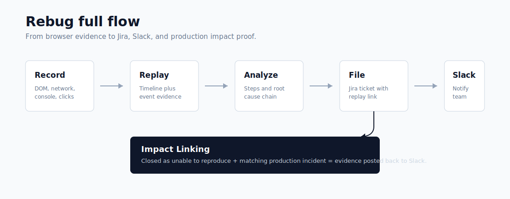
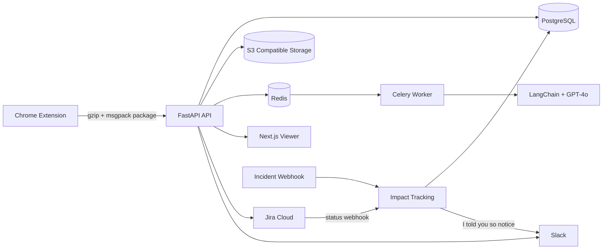

# Rebug

Works on my machine? Not anymore.


Rebug is a Chrome extension plus AI analysis backend that records bug sessions, replays them, generates reproduction steps, files Jira tickets, posts Slack notifications, and links ignored bugs to later production incidents.



## Demo

- Local viewer: `http://localhost:3000`
- Local API: `http://localhost:8000`
- Demo script: [docs/demo-video-script.md](docs/demo-video-script.md)
- Store listing draft: [docs/chrome-store-listing.md](docs/chrome-store-listing.md)

## Why

QA engineers lose time proving bugs exist. Developers lose time reading incomplete reports. Managers lose signal when valid bugs are closed as "unable to reproduce" and later appear as incidents.

## How

Rebug captures the browser event timeline, packages it locally, uploads it to a replay viewer, runs an AI analysis agent, and pushes the result into Jira and Slack.

The differentiator is Impact Linking: when a bug that was closed as `unable_to_repro` or `wontfix` later matches a production incident by URL pattern and error text, Rebug links the incident back to the original report and posts the evidence to Slack.

## What

- Chrome extension built with WXT, React, and TypeScript.
- DOM mutation, network, console, and interaction capture.
- IndexedDB local buffer via Dexie.
- FastAPI backend with PostgreSQL, Redis, Celery, Alembic, and S3-compatible storage.
- LangChain analysis agent for steps, root cause, and duplicate checks.
- Jira Cloud OAuth and ticket creation.
- Slack OAuth/webhook notifications.
- Next.js replay viewer and Impact dashboard.

## Architecture



## Local Development

Backend stack:

```bash
docker compose up -d --build
```

Viewer:

```bash
cd viewer
pnpm install
pnpm dev
```

Extension:

```bash
cd extension
pnpm install
pnpm dev
```

Load the generated extension in Chrome from `extension/.output/chrome-mv3`.

## Key Endpoints

- `POST /api/v1/sessions`
- `GET /api/v1/sessions/{id}/events`
- `POST /api/v1/sessions/{id}/analyze`
- `POST /api/v1/sessions/{id}/file`
- `GET /api/v1/integrations/status`
- `POST /api/v1/impact/incidents`
- `POST /api/v1/impact/jira-webhook`
- `GET /api/v1/impact/links`

## Deployment

See [docs/deployment.md](docs/deployment.md).

Primary targets:
- Backend API, worker, and beat: Railway or Fly.io
- Viewer: Vercel
- Extension: Chrome Web Store

## Repository

```text
backend/    FastAPI API, SQLAlchemy models, Celery tasks, integrations
extension/  WXT Chrome extension
viewer/     Next.js replay viewer and impact dashboard
docs/       Product, architecture, deployment, portfolio, demo assets
prompts/    AI analysis system prompt and examples
```
# rebug
